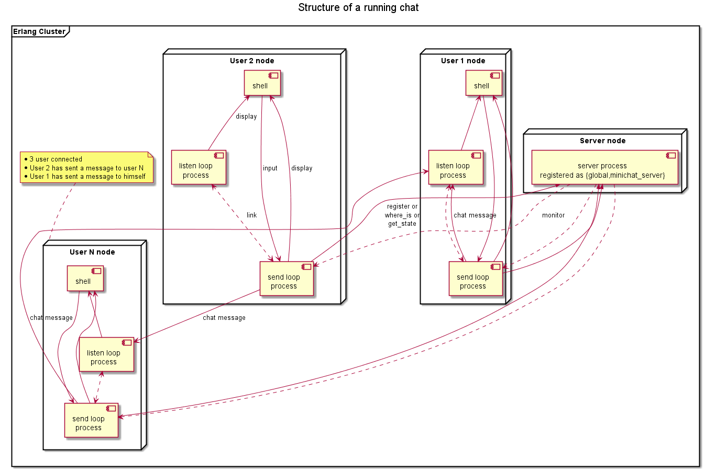

# Welcome to Single File MiniChat #

Copyright (c) 2016 Pascal Chapier

__Version:__ 0.1.0

__Authors:__ Pascal Chapier ([`pascalchap@gmail.com`](mailto:pascalchap@gmail.com)).

## Build ##

Clone the Git repositery, compile the unique file "minichat" in a valid erlang environment. This version was tested with Erlang/OTP 19, but
it should work with earlier version.

## Structure ##

Although the code is in a single file, this chat uses a bunch of processes to work:

<li> A server, registered as {global,minichat_server}, is used to solve the User addresses (get the user listen loop pid)</li>

<li> For each user, running on a dedicated node, a main loop is responsible to get the user input, react accordingly, and display some info in the shell panel(at least the prompt :o). The process is called __send loop__ but it is not registered</li>

<li> For each user as second loop is running, responsible to listen all the messages comming from other users and display them in the shell panel. The process is called __listen loop__, still not registered</li>

The following diagram shows all the processes and the different relationship between them in a chat system involving 3 users.

## Playing with the chat ##

Following a screen capture of the minichat in action.

## Modules ##

<table width="100%" border="0" summary="list of modules">
<tr><td><a href="doc/minichat.md" class="module">minichat</a></td></tr></table>

